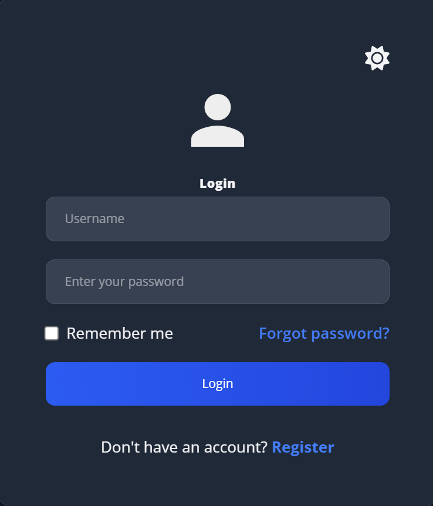
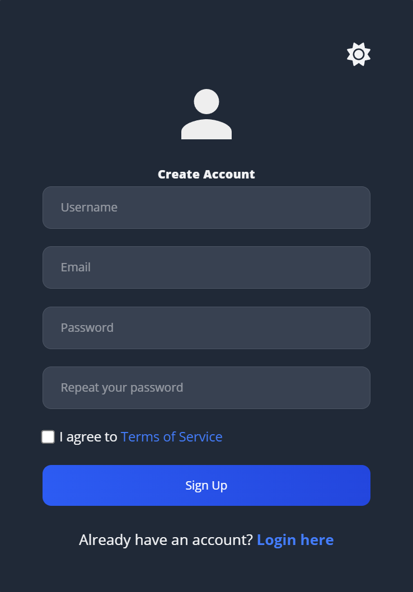
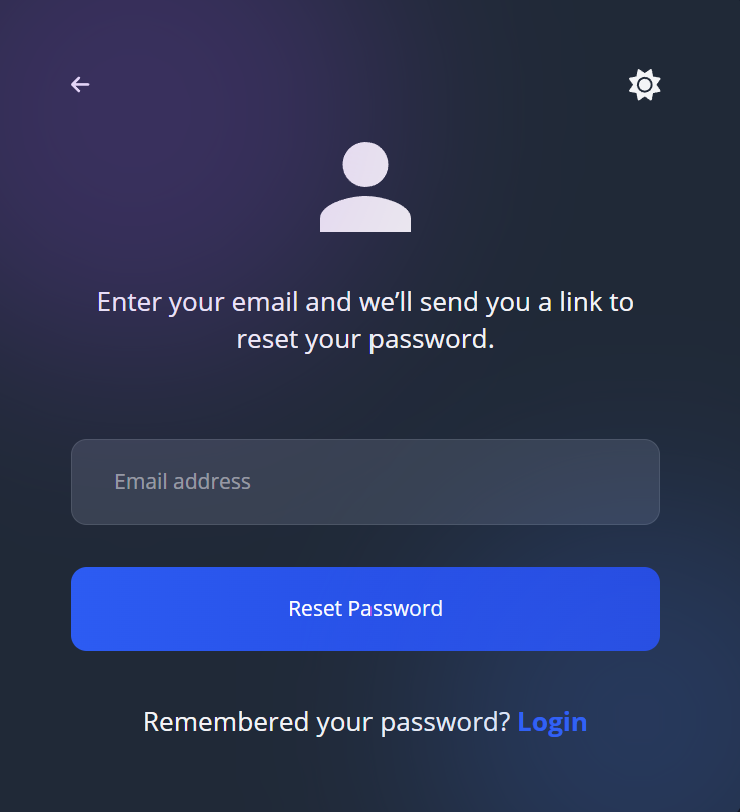
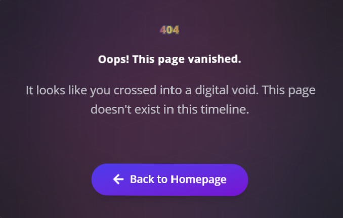

# E-Commerce Webshop Prototype
# 🐳 Get Started with Docker

### Prerequisites

- [Docker installed](https://docs.docker.com/get-docker/)

---

## Backend Dependency

This frontend expects a running backend at:

➡️ `http://<BACKEND_HOST>:5000`

→ For example, start the backend like this:

```bash
git clone https://github.com/CodeWizard2001/dummyBackendWebShop.git
cd dummyBackendWebShop
docker build -t webshop-backend .
docker run -p 5000:5000 webshop-backend
```

---

## Start the Frontend

### 1. Build Docker Image

```bash
docker build -t webshop-frontend .
```

### 2. Start Container

```bash
docker run -p 8080:80 webshop-frontend

```
The app will then be accessible at:
➡️ `http://<FRONTEND_HOST>:3000`

Replace `<FRONTEND_HOST>` with, for example:
- `localhost` (on your local machine)
- `192.168.x.x` (for LAN access, e.g., via mobile phone)
- `host.docker.internal` (for Docker-internal access)

---

#### 🧩 Optional: Start with Environment Variable

If the backend is accessible at a specific IP or domain (e.g., in a LAN or on a server), you can set the API URL via an environment variable:

```bash
docker run -p 8080:80   -e VITE_API_URL=http://<BACKEND_HOST>:5000   webshop-frontend
```

➡️ Replace `<BACKEND_HOST>` with, for example, `192.168.178.118`, `api.meine-seite.de` or `host.docker.internal` (for host access on Desktop).

➡️ The frontend will then use this API address on startup (works with `import.meta.env.VITE_API_URL` in the code).

---

## Tech Stack

**Frontend:**
- React (with TypeScript, Vite)
- Tailwind CSS, React-Bootstrap (Styling)
- Lucide, FontAwesome (Icons)
- Recharts (Data Visualization)
- Axios (HTTP Client)

**Backend:**
- Python Backend
- [dummyBackendWebShop](https://github.com/CodeWizard2001/dummyBackendWebShop)
---

## Project Structure
```plaintext
frontend_development/
├── src/
│   ├── App.tsx
│   ├── index.css
│   ├── main.tsx
│   ├── assets/
│   │   ├── my-logo.svg
│   │   └── css/
│   │       ├── _layout.css
│   │       ├── _reset.css
│   │       ├── _typography.css
│   │       └── main.css
│   ├── auth/
│   │   ├── AuthContext.tsx
│   │   └── useAuth.ts
│   ├── Components/
│   │   ├── NoPage.tsx
│   │   ├── Admin_Components/
│   │   │   ├── Header.tsx
│   │   │   ├── Sidebar.tsx
│   │   │   ├── StatCard.tsx
│   │   │   ├── ToggleTheme.tsx
│   │   │   ├── account/
│   │   │   │   └── AccountAside.tsx
│   │   │   ├── charts/
│   │   │   │   ├── CategoryDistributionChart.tsx
│   │   │   │   ├── SalesChannelChart.tsx
│   │   │   │   ├── SalesOverviewChart.tsx
│   │   │   │   ├── SalesTrendChart.tsx
│   │   │   │   ├── UserActivityHeatmap.tsx
│   │   │   │   └── UserGrowthChart.tsx
│   │   │   ├── form-functionalities/
│   │   │   │   ├── AddCustomerForm.tsx
│   │   │   │   ├── AddProductForm.tsx
│   │   │   │   ├── EditCustomerForm.tsx
│   │   │   │   └── EditProductForm.tsx
│   │   │   ├── settings/
│   │   │   │   ├── AccessibilitySettings.tsx
│   │   │   │   ├── AutosaveSettings.tsx
│   │   │   │   ├── DataManagementSettings.tsx
│   │   │   │   ├── DateTimeFormatSettings.tsx
│   │   │   │   ├── DefaultFileLocationSettings.tsx
│   │   │   │   ├── ExportDataSettings.tsx
│   │   │   │   ├── LanguageSettings.tsx
│   │   │   │   ├── Profile.tsx
│   │   │   │   ├── SettingSection.tsx
│   │   │   │   ├── TimezoneSettings.tsx
│   │   │   │   └── ToggleSwitch.tsx
│   │   │   └── tables/
│   │   │       ├── CustomersTable.tsx
│   │   │       └── ProductsTable.tsx
│   │   ├── Auth/
│   │   │   └── ProtectedRoute.tsx
│   │   ├── Main_Components/
│   │   │   ├── Navbar/
│   │   │   │   ├── navbar.css
│   │   │   │   └── Navbar.tsx
│   │   │   └── productCard/
│   │   │       └── ProductCard.tsx
│   ├── contexts/
│   │   ├── CartContext.tsx
│   │   └── ThemeContext.tsx
│   ├── Layout/
│   │   ├── AdminAccountLayout.tsx
│   │   ├── AdminLayout.tsx
│   │   └── MainLayout.tsx
│   ├── Pages/
│   │   ├── Admin/
│   │   │   ├── CustomersPage.tsx
│   │   │   ├── OverviewPage.tsx
│   │   │   ├── ProductsPage.tsx
│   │   │   ├── SettingsPage.tsx
│   │   │   └── Account/
│   │   │       ├── AccountPage.tsx
│   │   │       ├── DeleteAccountPage.tsx
│   │   │       ├── NotificationsPage.tsx
│   │   │       ├── PasswordPage.tsx
│   │   │       ├── ProfileSettingsPage.tsx
│   │   │       └── SocialPage.tsx
│   │   ├── Main/
│   │   │   ├── Cart/
│   │   │   │   └── cart.tsx
│   │   │   ├── ForgotPassword/
│   │   │   │   └── ForgotPasswordPage.tsx
│   │   │   ├── Home/
│   │   │   │   ├── home.css
│   │   │   │   └── Home.tsx
│   │   │   ├── Login/
│   │   │   │   └── Login.tsx
│   │   │   ├── ProductDetails/
│   │   │   │   └── ProductDetails.tsx
│   │   │   ├── ProductList/
│   │   │   │   └── ProductListPage.tsx
│   │   │   └── Register/
│   │   │       └── Register.tsx
│   ├── services/
│   │   └── api.ts
│   └── types/
│       └── index.ts
```

## Setup & Installation

1. **Clone the repository:** 

```bash
    `git clone <REPO_URL>`
```   

2. **Navigate to the project directory:**
```bash
   `cd <PROJECT_FOLDER>`
```

3. **Install dependencies:**
```bash
   `npm install`
```   

4. **Start the development server:**
```bash
    `npm run dev`
```


---

## Features

The following features define the core and extended functionality of our webshop.

### Must-Have Features (Essential for MVP)

* **Product Search and Filters**: Users can search for products using keywords and filter by categories, price range, or other attributes.
* **Shopping Cart**: Allows users to add products, update quantities, and remove items. A live total cost is shown and updated dynamically.
* **Checkout Process**: A guided, multi-step form to collect shipping and payment information. Ends with an order confirmation page.
* **Responsive Design**: Full support for both mobile and desktop views, ensuring a smooth and consistent experience across devices.
* **Light/Dark Mode Toggle**: Users can switch between light and dark themes for improved visual comfort.
* **User Authentication**: Includes user sign-up, login, and personalized account management.
* **Admin Dashboard**: Admins can manage products (CRUD operations).

### Nice-to-Have Features (Optional Improvements)

* **Wishlist / Favorites**: Allows users to save products for later or mark as favorites.
* **Product Reviews and Ratings**: Enables users to leave product reviews and ratings for community feedback.
* **Multi-language Support**: Adds support for multiple languages using localization files.

---

## Possible Future Features

These features are currently not planned for the initial release but represent potential areas for future development and enhancement.

* **Payment Gateway Integration**: Integration with popular payment gateways (e.g., Stripe, PayPal) for more robust payment processing.
* **Order History and Tracking**: Users can view their past orders and track the status of current shipments.
* **User Profiles and Personalization**: More extensive user profiles with personalized recommendations based on Browse history and past purchases.
* **Newsletter Subscription**: Allows users to subscribe to email newsletters for updates and promotions.
* **Discount Codes and Promotions**: Functionality for applying discount codes and managing promotional offers.
* **Inventory Management**: Advanced features for tracking product stock and managing inventory levels for administrators.
* **Customer Support Chatbot**: Integration of an AI-powered chatbot for instant customer support.
* **Social Media Sharing**: Users can easily share products on their social media platforms.
* **Seller Accounts**: Ability for multiple sellers to list and manage their products (if applicable to the business model).
* **Advanced Analytics Dashboard**: More comprehensive analytics for administrators, including sales trends, popular products, and user engagement.

---

## User Roles and Interactions

This section explains the different types of users who interact with our e-commerce webshop, their permissions, and the actions they can typically perform.

### Administrator/Admin

The Administrator oversees the overall management of the webshop. This role has the highest level of access and can modify nearly every aspect of the site.

**Typical Actions and Expected Outcomes:**

* The admin can add, update, and remove products from the catalog; any changes are instantly visible to customers. For example, the admin might add a new product, such as *wireless headphones*, with a price of *129.99 €*.
* The admin can also manage user accounts – such as viewing user information or deleting accounts if it's needed.

### Customer (Registered User)

Customers are users who have registered an account on the webshop. They can explore products, place orders, and manage their personal details and order history.

**Typical Actions and Expected Outcomes:**

* Customers can browse all available products, read detailed descriptions, and check their prices.
* They can also use the search bar or apply filters, such as by category, to narrow down the results.
* Add products to the shopping cart for quick purchase.
* Can proceed to checkout, choose a payment method, and complete their order easily.
* Update personal information, including name, email, and password.

### Guest User (Unregistered User)

A guest user can browse the webshop without creating an account, though their access is limited.

**Typical Actions and Expected Outcomes:**

* Can browse the products without logging in.
* Can register or Sign In.
* Can add products to the cart, but the cart will remain active only while they are on the website. Once they leave, everything will be removed. The users must have an account to purchase the products otherwise it will be not possible.

---

## Screenshots

Here are some screenshots showcasing different aspects of the webshop application.

### Login and Sign-up and Forgot Password

<p>
  &nbsp;&nbsp;&nbsp;&nbsp;&nbsp;&nbsp;&nbsp;&nbsp;&nbsp;&nbsp;&nbsp;&nbsp;&nbsp;
  &nbsp;&nbsp;&nbsp;&nbsp;&nbsp;&nbsp;&nbsp;&nbsp;&nbsp;
  
</p>

### 404 (Not Found) page
<p>
    
</p>

**For more screenshots and visual representations of the project's look and feel, please check the [`assets/screenshots`](./assets/screenshots) and [`Mockup/pictures`](./Mockup/pictures) directories.**

---

# Quick Guide: E-Commerce Webshop
[https://github.com/user-attachments/assets/a1c67f63-c21c-4727-a8f5-aa32ec804d40](https://github.com/user-attachments/assets/f3b2ef7c-036c-4c04-bb27-feceed8c14c5)

Link for the video: [Webshop](https://github.com/user-attachments/assets/f3b2ef7c-036c-4c04-bb27-feceed8c14c5)

## License ⚖️

This project is licensed under the MIT License. For more details, please refer to the file: [LICENSE](LICENSE).

## Contributor
[Kristian Popov](https://github.com/PhoenixMaster123) <br>
[Enrico Ebert](https://github.com/CodeWizard2001) <br>
[Glison Doci](https://github.com/gl150n1) <br>
[Orik Mazreku](https://github.com/OrikMarin) <br>
